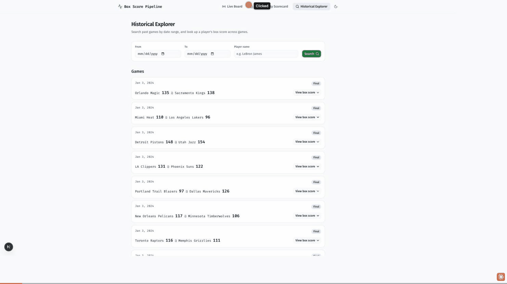

# Live Box Score Pipeline & Data Quality Observatory

An end-to-end data engineering project built on NBA box score and live game
data — the portfolio-differentiating work is the ingestion, reconciliation,
and drift monitoring, not the dashboard on top of it. Two independent
sources feed the same games through a Bronze/Silver/Gold warehouse, and
every disagreement between them is logged, not silently resolved.



Full design doc: [`docs/prd.md`](docs/prd.md) (source: [PRD artifact](https://claude.ai/code/artifact/1f4076ad-1c3c-403a-b3a5-d987db3f10d0)). Build history and current status: [`docs/PROGRESS.md`](docs/PROGRESS.md). Real-load-test results: [`docs/performance-loadtest.md`](docs/performance-loadtest.md). Security review: [`docs/security-audit.md`](docs/security-audit.md). Resume bullets: [`docs/resume-bullets.md`](docs/resume-bullets.md).

**Status: all 6 weeks of the PRD's plan (§12) are complete** — foundations,
live ingestion, serving layer, security hardening, UI furnishing, and a
final QA pass with a real load test and browser walkthrough. 215 tests
passing across 4 Python services, CI green on every PR.

## Layout

This is a polyrepo-style monorepo — independent Python/Node projects, each
with its own dependency manifest, plus shared infra at the root — matching
the architecture diagram in the PRD:

| Path         | What it is                                                        |
|--------------|--------------------------------------------------------------------|
| `db/`        | SQLAlchemy models + hand-written Alembic migrations for the Bronze/Meta tables and least-privilege Postgres roles (`ingestion_writer`, `api_reader`). |
| `ingestion/` | Prefect flows — `backfill_flow`/`backfill_stats_flow` (historical) and `live_game_flow` (polling), pulling from two independent sources (balldontlie API + a public live-scoreboard feed) into Postgres Bronze. |
| `dbt/`       | dbt project — Silver (typed/deduped staging) and Gold (`games`, `player_game_stats`) models. |
| `quality/`   | Schema fingerprinting, volumetric checks, PSI statistical drift, and cross-source reconciliation — the data-quality gate that watches the pipeline. |
| `api/`       | FastAPI serving layer — `/games`, `/player-stats`, `/quality`, `/live` (SSE), reads Gold + quality tables, API-key auth + rate limiting on every route, never faces the browser directly. |
| `web/`       | Next.js app (Vercel) — the BFF. Holds the FastAPI API key server-side and is the only thing the browser talks to; pages are Live Board, Data Quality Scorecard, and Historical Explorer; re-streams FastAPI's live SSE via `EventSource`. |
| `docs/`      | PRD, build log (`PROGRESS.md`), security audit, load-test report, demo GIF. |

## Quickstart

Requires Docker Desktop running, Node 20+, Python 3.13 + [uv](https://docs.astral.sh/uv/), and (optionally, for real data) a free [balldontlie](https://balldontlie.io) API key.

```bash
cp .env.example .env            # fill in BALLDONTLIE_API_KEY and API_SERVICE_KEY (any random string)
make up                         # starts Postgres + Redis
make ps                         # confirm both are healthy

make migrate                    # creates the schema + least-privilege roles
cd dbt && cp profiles.yml.example profiles.yml && uv run dbt deps && uv run dbt run
```

Then, from the repo root:

```bash
make test-db          # 16 tests
make test-ingestion   # 69 tests
make test-api         # 76 tests (includes real rate-limit enforcement, SQL-injection/auth-bypass audit)
make test-quality     # 54 tests
make test-all         # all four of the above — 215 tests total
make dbt-parse
cd web && npm ci && npx next typegen && npx tsc --noEmit && npm run lint && npm run build
```

To actually run the stack:

```bash
make api-dev   # FastAPI on :8000
```
```bash
cd web && cp .env.local.example .env.local  # set FASTAPI_BASE_URL + API_SERVICE_KEY to match api/.env
make web-dev                                 # http://localhost:3000, /live, /quality
```

Pull some real historical data before expecting `/games`/`/quality`/`/explorer` to show anything (requires `BALLDONTLIE_API_KEY`):

```bash
cd ingestion && PYTHONPATH=src:../db/src uv run python -c "
from ingestion.flows.backfill_flow import backfill_flow
print(backfill_flow(start_date='2024-01-01', end_date='2024-01-03'))
"
make dbt-run   # rebuild Gold tables against the new raw_pulls rows
```

Player box scores (`player_game_stats`, backing `/player-stats` and Historical
Explorer's box-score view) need `backfill_stats_flow` run the same way against
balldontlie's `/stats` endpoint — **note that endpoint requires balldontlie's
paid ALL-STAR tier ($9.99/mo+)**, confirmed via a real `401 Unauthorized` on
the free tier (see `docs/PROGRESS.md`'s Known Issues). This project runs on
the free tier, so `player_game_stats` stays empty by design; the UI's
box-score section correctly shows an empty state rather than an error.

Load test the API for real (needs a running `api-dev` and Postgres/Redis):

```bash
cd api && API_SERVICE_KEY="<your local key>" uv run locust -f loadtest/locustfile.py \
    --host http://localhost:8001 --headless --users 30 --spawn-rate 5 --run-time 60s
```

See [`docs/performance-loadtest.md`](docs/performance-loadtest.md) for real
results (0 failures, p95 ~23-26ms at 30-50 concurrent users — well under the
PRD's <300ms target).

`ingestion` and `api` each prefer their own least-privilege DB role DSN —
`INGESTION_DATABASE_URL` (`ingestion_writer`) and `API_DATABASE_URL`
(`api_reader`) respectively — and fall back to the admin `DATABASE_URL` if unset.

`make down` stops the compose stack; `make logs` tails it. CI (`.github/workflows/ci.yml`) runs all of the above automatically on every push/PR, including `dbt` against a real ephemeral Postgres.

**Why the `make` targets set `PYTHONPATH` explicitly:** `db`/`ingestion`/`api`/`quality` share the `db` package as an editable path dependency, normally made importable via a `.pth` file `uv` writes into each service's venv. On some machines — observed with iCloud Drive's "Desktop & Documents Folders" sync enabled on a project living under `~/Documents` — those `.pth` files intermittently get macOS's hidden file flag reapplied by something outside `uv`'s control, which breaks the import (`ModuleNotFoundError: No module named 'db'`) even though the venv is otherwise fine. `PYTHONPATH` bypasses that fragile file-based mechanism entirely, so the `make` targets set it defensively. If you invoke `uv run` directly instead of through `make` (e.g. for a one-off script, as in the backfill example above), add `PYTHONPATH=src:../db/src` (or just `PYTHONPATH=src` from inside `db/` itself, which has no such dependency) yourself — or diagnose the `.pth` flag directly with `find .venv/lib/python3.13/site-packages -name "*.pth" -exec stat -f "%f %N" {} \;` (a value with the `32768` bit set, e.g. `32832`, means hidden; fix with `chflags nohidden`).

## Status

See [`docs/PROGRESS.md`](docs/PROGRESS.md) for the full build log and known
caveats — kept up to date throughout the build. Short version: all 6 weeks
of `docs/prd.md` §12's plan are complete, merged to `main`, and verified
against real infrastructure and a real browser, not just tests:

- **Real data flowing end-to-end**: balldontlie backfill → Bronze → dbt
  staging/marts → FastAPI → BFF → Next.js dashboard.
- **Real security review**: manual SQL-injection/auth-bypass pass
  (`docs/security-audit.md`), API key confirmed (via a real browser's
  network tab) to never reach the client.
- **Real load test**: found and fixed a genuine rate-limiting bug under
  realistic concurrency; re-verified at 0 failures, p95 ~23-26ms against a
  <300ms target (`docs/performance-loadtest.md`).
- **Real browser walkthrough**: theme toggle, empty/loading/error states,
  Historical Explorer search, and keyboard focus all confirmed working in
  an actual Chrome session, not just by code inspection.
- **Known, accepted limitations** (documented, not oversights): player box
  scores require balldontlie's paid tier and are left empty on the free
  tier; the win-probability stretch model is deferred pending real
  live-game-window data; mobile-breakpoint rendering rests on code review
  rather than a live visual check due to a browser-automation tooling
  limitation hit during the final QA pass.
