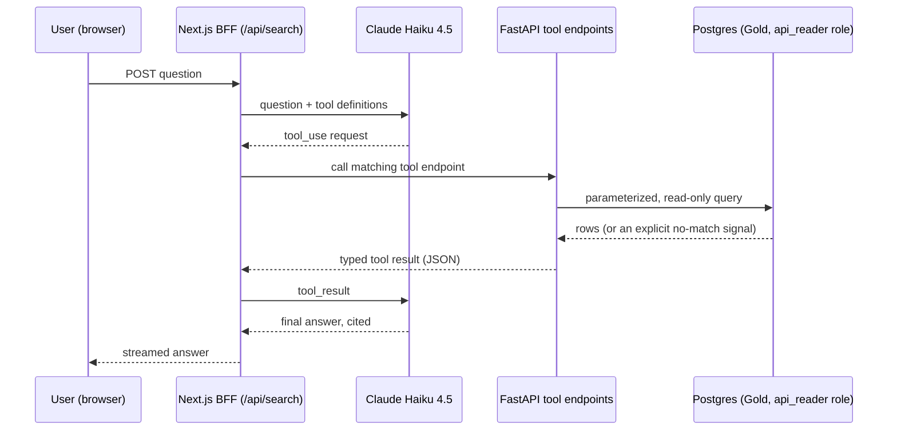

# Architecture Diagrams

## Request flow (per question)

The BFF is the only component holding the LLM API key (server-side, never sent to the browser — same pattern as `API_SERVICE_KEY`). FastAPI is the only component that talks to Postgres, using the same `api_reader` role every other read path in this project already uses. The LLM never sees a database credential or a raw SQL surface — only the four named tools in `query-tools.md`.
